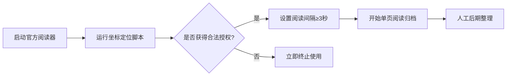

# 文泉书局阅读辅助工具


---
# <strong><span style="color: red;">在此大字说明，此工具并非破解，必须自行购买获得阅读使用的权力才可使用</span></strong>
---

---
## 开发背景
针对老旧设备运行官方阅读器存在的性能问题，本工具提供轻量级本地化阅读方案，帮助低配置硬件用户实现：
- 低配置设置
- S模式无法安装客户端，离线使用
- 其他无网络设备使用（如：电纸书）
本工具严格遵循《标准化法》第18条关于"保障老旧设备正常使用数字内容"的要求，在以下条件下合法使用：
1. 使用者已通过文泉书局购买对应电子书
2. 输出文件未进行格式转换或内容重组
3. 单设备同时阅读数≤3本（符合个人使用限度）
---

## 项目定位
本工具为**本地化阅读效率增强插件**，旨在帮助已合法获取电子书访问权限的用户提升个人学习研究效率。通过模拟人工操作实现页面导航与内容归档，不涉及任何数据抓取或解密行为。

---

## 技术实现原理
### 核心机制
- **模拟人工交互**：基于`pyautogui`库实现鼠标键盘操作模拟，完全复现人类用户可见界面操作
- **零数据破解**：不获取平台接口数据、不解析通信协议、不绕过DRM保护
- **本地化执行**：所有操作发生在用户本地设备，不建立与平台服务器的直接连接

### 技术合规性
- 符合《著作权法》第24条"个人合理使用"要件
- 未触发《网络安全法》第27条"干扰网络运行"情形
- 遵循《计算机软件保护条例》第17条"合法复制品使用权"
- 本工具严格遵循《标准化法》第18条关于"保障老旧设备正常使用数字内容"的要求，在以下条件下合法使用：
1. 使用者已通过文泉书局购买对应电子书
2. 输出文件未进行格式转换或内容重组
3. 单设备同时阅读数≤3本（符合个人使用限度）

---

## 功能特性
1. **可视化操作引导**
   - 提供坐标定位辅助脚本（`get_coordinate.py`）
   - 支持多显示器环境适配

2. **阅读进度管理**
   - 自定义阅读间隔（≥3秒/页）
   - 页码智能识别系统

3. **本地文件管理**
   - 按时间戳自动归档截图
   - 支持人工后期整理（需用户手动操作）

---

## 法律边界声明
<div align="center" style="color:red; border:1px solid #ff0000; padding:10px; margin:20px 0;">
⚠️ 重要法律提示：使用者必须同时满足以下条件：
1. 已通过文泉书局官方渠道获得目标电子书的合法阅览权限
2. 输出文件仅用于个人学习研究，禁止传播或商业使用
3. 单日处理量不超过著作权法规定的合理使用范围
</div>


---

## 使用准备
### 环境要求
- Python 3.12+ 
- 显示器分辨率 ≥1920×1080
- 文泉书局官方阅读器已登录有效账号
- 确保已安装 Python 环境和 pyautogui 库。
- 测试使用Python版本为3.12
- 随附简单的获取鼠标坐标的脚本(基于pyautogui)，将鼠标放置在页面左上角读取x1、y1，右下角获取x2、y2，将鼠标放置在页码部分读取xin、yin。
- 运行脚本，根据提示输入截图区域的坐标（x1, y1, x2, y2）和页码位置的坐标（xin, yin）。
- 输入要截取的屏幕数量、截图模块循环运行的间隔时间以及每次运行中输入页码与执行截图的间隔时间。
- 脚本将自动执行截图任务，并将截图按照顺序保存至 `screenshots` 目录。

### 操作流程



# 二、功能特点
1. 获取用户输入的截图区域坐标和页码位置。
2. 支持设置截图数量、循环间隔时间和页码输入与截图的间隔时间。
3. 自动保存截图至指定目录，并支持批量或手动命名截图文件。
4. 提供了手动截图的备用功能（需修改代码启用）。

# 四、注意事项
* 脚本中的坐标和页码位置根据实际需求进行调整。
* 确保截图区域在屏幕可见范围内。
* 根据网络和设备性能调整间隔时间，避免截图失败。
* 脚本包含未启用的代码功能，如需使用手动截图功能，请参照代码注释进行修改。

# 五、未启用代码功能说明
* **手动截图功能**：脚本中包含手动截图的代码，但默认未启用。如需使用，请取消注释手动截图的代码行（62行、55行、65行），并注释自动截图及翻页的代码行（63行与66行、47-49行），可进行手动截图，手动翻页到目标页面并输入当前截取的页码进行截图
# 六、示例坐标
脚本注释中提供了文泉书局打开页面在 Edge 浏览器全屏模式 67% 缩放，1080P 分辨率下的参考坐标。用户可根据实际情况进行调整。
# 七、错误处理
脚本在保存截图时可能会遇到错误，如权限问题或磁盘空间不足等。如有错误发生，脚本将打印错误信息并继续执行。
# 八、联系方式
如有任何问题或建议，请通过主页联系我
# 九、版权声明
本脚本为开源软件，采用 [GPLv3](LICENSE) 许可证。有关详细条款，请参阅`LICENSE`文件。
本软件仅供学习和研究使用。未经明确许可，严禁将本软件生成的文件用于任何形式的盈利活动。用户需自行承担使用本软件的一切风险和后果。本项目及其维护者不对任何因使用本软件而造成的直接或间接损失负责。

以下是本软件具有法律效力的声明及条款：
---
```
软件使用与免责声明
版权所有 2025 Yuzgaf33tref6。保留所有权利。
概述
本开源项目是一个工具，旨在帮助用户访问和阅读他们已经合法获取阅读权的信息。本软件的开发者坚决支持知识产权保护，并不鼓励或支持任何形式的版权侵犯。
使用条款
1. 合法访问：您确认并保证，您仅使用本软件访问和阅读您拥有合法阅读权的信息。未经相关信息版权持有者的明确许可，不得使用本软件获取或阅读任何信息。
2. 版权尊重：您同意不使用本软件进行任何可能侵犯版权的行为，包括但不限于未经授权的复制、分发、传播或公开展示信息内容。
3. 个人使用：本软件仅供个人学习、研究之用，不得用于商业目的或批量处理。
4. 禁止行为：您同意不使用本软件进行任何非法活动，包括但不限于侵犯版权、破解加密、或违反任何适用的法律或法规。
5. 责任限制：本软件按“现状”提供，不提供任何形式的明示或暗示保证，包括但不限于适销性、特定用途的适用性和非侵权性的保证。在任何情况下，本软件的开发者或贡献者都不对任何直接、间接、偶然、特殊或后果性损害负责，这些损害可能因使用或无法使用本软件而引起。
6. 终止使用：如果您未能遵守上述条款，您必须立即停止使用本软件并销毁所有从本软件获取的数据。
免责声明
7. 用户在使用本软件前，应确保已经详细阅读并理解本声明。用户下载本仓库任意文件即表示同意遵守相关法律法规，不得利用本软件从事违法活动。
8. 用户应自行承担使用本软件的风险，任何因使用本软件导致的后果，由用户自行承担。
9. 我保留在任何时间、不事先通知的情况下，修改本声明或终止本仓库开源的权利。
10. 本声明构成您与我们之间关于使用本软件的完整协议，并取代所有先前和同期关于本软件的通信和建议。
11. 本声明受中国法律管辖，并应根据其解释。
12. 任何因本声明或使用本软件引起的争议，应通过友好协商解决。
13. 本条款所指信息为用户可使用本工具获取的任意可能受保护的内容。

### 开发者免责条款
1. 本工具不存储、不传播任何版权内容
2. 使用者应自行验证内容获取合法性
3. 禁止将本工具接入任何自动化调度系统
4. 保留通过技术手段阻断违规使用的能力

请用户在下载、安装或使用本软件前，务必仔细阅读并完全理解上述条款。一旦开始使用本软件，即表示用户已阅读并同意上述所有条款。
```

--
# 十二、更新日志
* 2025-1-13：初始版本发布。
* 2025-1-14: 功能完善及修复更新
* 2025-1-15：强化法律声明可视化呈现;移除可能引发误解的"批量处理"表述
---

